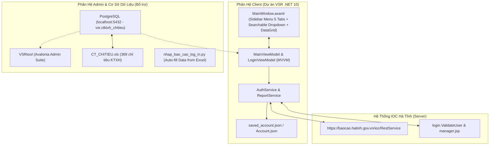
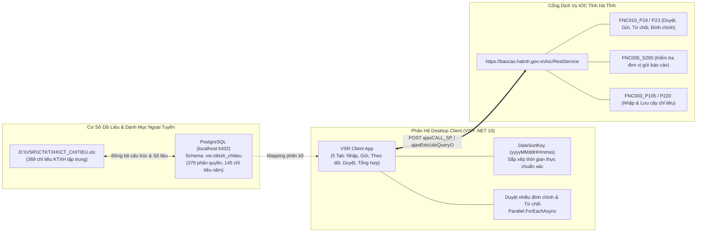
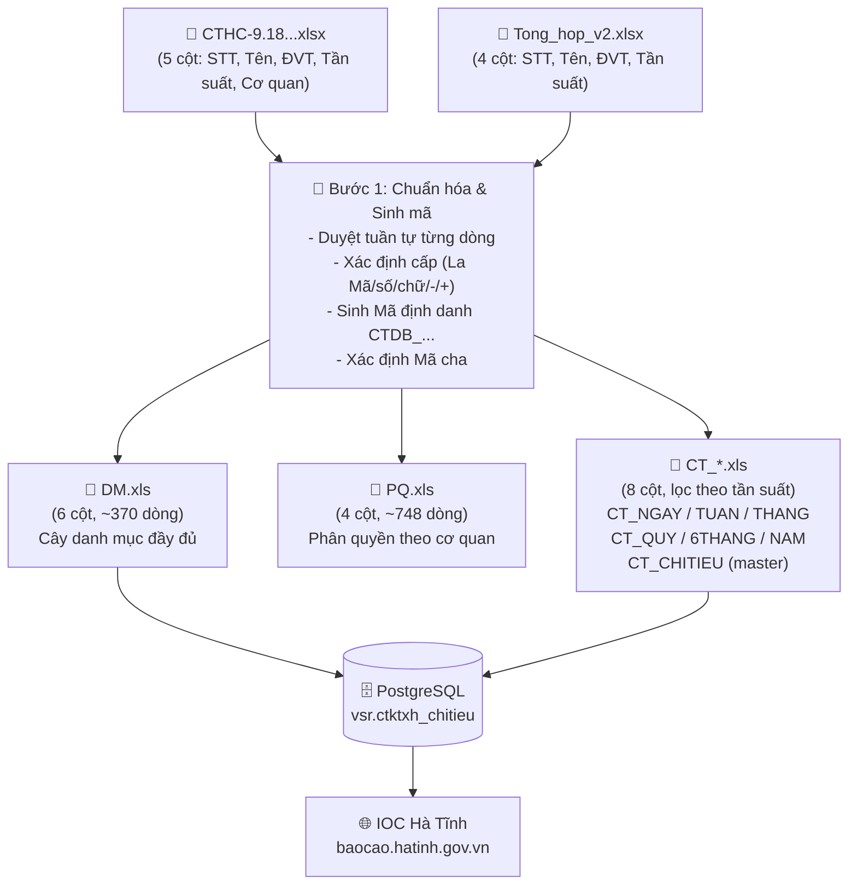

# TÀI LIỆU KỸ THUẬT & HƯỚNG DẪN DỰ ÁN VSR (CLIENT APP - .NET 10 / AVALONIA UI)

> **Tên dự án**: VSR - Phần Mềm Quản Lý & Nhập Liệu Báo Cáo IOC Hà Tĩnh (Client Edition)  
> **Tệp cấu hình Project**: [`VSR.csproj`](file:///d:/VSR/VSR/VSR/VSR.csproj)  
> **Đường dẫn thư mục**: `d:\VSR\VSR\VSR\`  
> **Nền tảng công nghệ**: C# 13, .NET 10.0 (`net10.0`), Avalonia UI 12.1.0, MVVM Pattern  
> **Mục tiêu**: Ứng dụng Desktop toàn diện cho các Sở, Ban, Ngành, Đơn vị trực thuộc tỉnh Hà Tĩnh tra cứu, nhập liệu, gửi duyệt, theo dõi tiến độ và tổng hợp số liệu báo cáo qua 5 phân hệ tác vụ (**Nhập báo cáo**, **Gửi báo cáo**, **Theo dõi trạng thái**, **Duyệt báo cáo**, **Tổng hợp số liệu**), lọc dữ liệu đa chiều và tích hợp cơ sở dữ liệu quan hệ PostgreSQL trên hệ thống Trung tâm Điều hành Thông minh (**IOC Hà Tĩnh** - `https://baocao.hatinh.gov.vn/ioc/RestService`).

---

## 1. Tổng quan Dự án & Vị trí trong Hệ sinh thái VSR

Hệ sinh thái **VSR (Hà Tĩnh IOC)** bao gồm 4 phân hệ chính:
1. **`VSR` (Dự án này - `d:\VSR\VSR\VSR`)**: Ứng dụng Desktop Client dành cho Đơn vị / Sở Ban Ngành quản lý trọn vẹn vòng đời báo cáo qua 5 Tab nghiệp vụ (`Nhập báo cáo số liệu`, `Gửi báo cáo`, `Theo dõi trạng thái báo cáo`, `Duyệt báo cáo`, `Tổng hợp báo cáo`), lọc đa chiều theo biểu mẫu / cơ quan / chu kỳ / trạng thái, hỗ trợ sắp xếp theo thời gian thực chuẩn xác (`DateSortKey`) và duyệt đính chính hàng loạt.
2. **`VSRtool` (`d:\VSR\VSR tool\VSRtool\VSRtool`)**: Ứng dụng Desktop Admin dành cho Quản trị viên Tỉnh (Giao báo cáo hàng loạt `FNC001_P15H`, Thu hồi báo cáo `FNC019_P01`, Quản lý & Xóa cây danh mục `ADM007_008`).
3. **Phân hệ Cơ sở Dữ liệu PostgreSQL & Chuẩn Hóa Chỉ Tiêu (`CTKTXH`)**: CSDL PostgreSQL cục bộ (`localhost:5432`, schema `vsr.ctktxh_chitieu`) quản lý 369 chỉ tiêu KTXH tập trung và 379 lượt phân quyền 15 Sở ngành, đồng bộ cùng file danh mục chuẩn `CT_CHITIEU.xls`.
4. **Bộ kịch bản Python (`nhap_bao_cao_log_in.py`, `tool_giao_baocao.py`, `Excute.py`...)**: Kịch bản chạy ngầm tự động đọc dữ liệu từ Excel (`Backup/`) và nạp số liệu trực tiếp vào server IOC.



---

## 2. Cấu trúc Thư mục & Chi tiết Thành phần Codebase

```
d:\VSR\VSR\VSR\
├── VSR.csproj                      # Cấu hình project .NET 10 & các NuGet package Avalonia 12.1.0
├── App.axaml / App.axaml.cs        # Theme Fluent, nạp DataGrid Fluent Style, vòng đời App
├── MainWindow.axaml / .cs          # Giao diện chính (Sidebar Menu 5 mục + Searchable Dropdown + DataGrid)
├── Program.cs                      # Điểm vào chính của ứng dụng (Main Entry Point)
├── app.manifest                    # Manifest cấu hình DPI-awareness & Windows Compatibility
├── Models/                         # Đối tượng dữ liệu (Data Transfer Objects)
│   ├── AccountCredential.cs        # Thông tin tài khoản lưu trữ (Username, Password, ApiUrl, UnitName)
│   ├── AuthSession.cs              # Phiên đăng nhập (Cookie, UUID, UserID, OrgID, TenantID)
│   ├── ReportItem.cs               # Chuẩn hóa Trạng thái, DateSortKey (yyyyMMddHHmmss), Badge màu
│   └── RestServicePayload.cs       # Cấu trúc payload JSON gửi tới /ioc/RestService
├── Services/                       # Tầng dịch vụ kết nối mạng & Xử lý nghiệp vụ
│   ├── AuthService.cs              # Bypass Captcha RealPerson, đăng nhập, trích xuất UUID phiên
│   └── ReportService.cs            # Gọi các thủ tục IOC (FNC002, FNC010, FNC006, FNC003)
└── ViewModels/                     # Tầng điều khiển giao diện (MVVM Pattern)
    ├── ViewModelBase.cs            # Lớp cơ sở cài đặt INotifyPropertyChanged & SetProperty
    ├── LoginViewModel.cs           # Quản lý Form đăng nhập, danh sách tài khoản mẫu, tự động đăng nhập
    └── MainViewModel.cs            # Điều khiển 5 Tab Sidebar, lọc đa chiều, xử lý đính chính/từ chối hàng loạt
```

---

## 3. Kiến trúc Menu & Các Tính Năng Giao Diện Cốt Lõi

### 3.1. Menu Điều Hướng Bên Trái (Left Sidebar Navigation)
Giao diện ứng dụng được thiết kế theo cấu trúc điều hướng chuẩn của IOC Hà Tĩnh với thanh menu phân loại bên trái gồm 5 mục chính:

1. ✏️ **Nhập báo cáo số liệu (`SelectedNavIndex = 0`)**:
   * **Nguồn dữ liệu**: Truy vấn qua thủ tục `FNC002_S107_1` (`fcode: "FNC002"`).
   * **Các trạng thái**:
     * `Đang nhập liệu` / `Đã giao` / `Đang nhập liệu/tổng hợp` (Status 1, 1.0).
     * `Bị từ chối / Trả lại` / `Yêu cầu nhập lại` (Status 5, 5.0).
     * `Yêu cầu đính chính` / `Hủy duyệt để đính chính` (Status 6, 7, 8).
   * **Badge đếm số lượng**: `{InputReportsCount}`.
   * **Màu sắc chỉ báo**: Viền cam đậm `#EA580C`, nền sáng `#FFF7ED`.

2. 🚀 **Gửi báo cáo (`SelectedNavIndex = 1`)**:
   * **Nguồn dữ liệu**: Truy vấn qua thủ tục `FNC010_S22_2` (`fcode: "FNC010"`).
   * **Các trạng thái**:
     * `Đã trình lãnh đạo` (Status 2, 2.0).
     * `Lãnh đạo đã duyệt` / `Đã gửi cấp trên` / `Đã gửi Tỉnh` (Status 3, 3.0).
     * `Đã phê duyệt` / `Đơn vị giao đã phê duyệt` (Status 4, 4.0).
   * **Badge đếm số lượng**: `{SubmitReportsCount}`.
   * **Màu sắc chỉ báo**: Viền xanh dương đậm `#1E40AF`, nền sáng `#EFF6FF`.
   * **Cột Ngày kết thúc**: Giữ nguyên tiêu đề **"Ngày kết thúc"** (hạn nộp báo cáo).

3. 📊 **Theo dõi trạng thái báo cáo (`SelectedNavIndex = 2`)**:
   * **Nguồn dữ liệu**: Truy vấn qua thủ tục `FNC010_S24` (`fcode: "FNC010"`).
   * **Các trạng thái**: `Báo cáo đã được gửi` (Status 3), `Báo cáo đã được duyệt` (Status 4).
   * **Badge đếm số lượng**: `{TrackingReportsCount}`.
   * **Cột Ngày duyệt**: Thay thế cột "Ngày kết thúc" bằng tiêu đề **"Ngày duyệt"**.
     * Nếu trạng thái là **Báo cáo đã gửi**: để trống.
     * Nếu trạng thái là **Báo cáo đã được duyệt**: hiển thị thời điểm báo cáo được duyệt (`ApprovedDate`).

4. 🛡️ **Duyệt báo cáo (`SelectedNavIndex = 3`)**:
   * **Nguồn dữ liệu**: Truy vấn qua thủ tục `FNC010_S20` (`fcode: "FNC010"`).
   * **Các trạng thái**: `Báo cáo đã gửi & Yêu cầu đính chính` (Status 3, Status 4 khi có yêu cầu đính chính), `Báo cáo đã được duyệt` (Status 4).
   * **Badge đếm số lượng**: `{ApprovalReportsCount}`.
   * **Cột Ngày duyệt**: Thay thế cột "Ngày kết thúc" bằng tiêu đề **"Ngày duyệt"**.
     * Nếu trạng thái là **Báo cáo đã gửi**: để trống.
     * Nếu trạng thái là **Báo cáo đã được duyệt**: hiển thị thời điểm báo cáo được duyệt (`ApprovedDate`).
     * **Quy tắc sắp xếp (DateSortKey)**: Sắp xếp theo khóa số học chuẩn `yyyyMMdd` (thay vì so sánh chuỗi ký tự thông thường), đảm bảo định dạng ngày Việt Nam `dd/MM/yyyy` luôn được sắp xếp theo đúng trình tự thời gian từ cũ đến mới hoặc ngược lại.
   * **Nút "Duyệt nhiều yêu cầu đính chính"**:
     * Hiển thị trên thanh tiêu đề của phân hệ **Duyệt báo cáo** (màu cam `#D97706`, icon 📝), nằm cạnh nút *Duyệt nhiều báo cáo*.
     * Huy hiệu (Badge) trên nút **chỉ đếm số lượng các báo cáo đang được tích chọn có cờ yêu cầu đính chính** (`CorrectionReq > 0`).
     * Khi nhấn nút, hộp thoại hiển thị danh sách các báo cáo có yêu cầu đính chính kèm 2 lựa chọn:
       - **Đồng ý**: Trả lại báo cáo cho đơn vị cấp dưới để mở quyền sửa số liệu (`StateId = 6`), báo cáo được xóa khỏi danh sách duyệt.
       - **Không đồng ý**: Giữ nguyên trạng thái `Báo cáo đã được duyệt` (`StateId = 4`), gỡ bỏ cờ yêu cầu đính chính.
     * Cơ chế xử lý song song đa luồng tối ưu (chỉ mất ~1-2 giây hoàn tất cho toàn bộ danh sách).

5. ⚡ **Tổng hợp báo cáo (`SelectedNavIndex = 4`)**:
   * **Nguồn dữ liệu**: Truy vấn qua thủ tục `FNC002_S08` (`fcode: "FNC002"`).
   * **Badge đếm số lượng**: `{AggregateReportsCount}`.
   * **Cột Ngày kết thúc**: Giữ nguyên tiêu đề **"Ngày kết thúc"** (hạn nộp báo cáo, sắp xếp chuẩn theo `DateSortKey`).

---

## 4. Tầng Dịch vụ & Hai Thủ Tục Stored Procedure Truy Vấn Báo Cáo

Hệ thống IOC chia tách rõ ràng 2 endpoint/stored procedure cho 2 giai đoạn vòng đời báo cáo:

| Mục / Phân hệ | Stored Procedure | Fcode | Option quan trọng | Đối tượng & Nghiệp vụ |
| :--- | :--- | :---: | :--- | :--- |
| **Nhập báo cáo số liệu** | `FNC002_S107_1` | `FNC002` | `[0]=Tenant`, `[7]=Org`, `[8]=7`, `[13]=User` | Lấy danh sách hộp thư các biểu mẫu đang ở trạng thái nhập liệu (State 1) hoặc bị từ chối (State 5). |
| **Gửi báo cáo** | `FNC010_S22_2` | `FNC010` | `[0]=Org`, `[11]=Tenant`, `[18]=Tenant`, `[19]=User` | Lấy danh sách các biểu mẫu đã trình lên lãnh đạo (State 2) hoặc lãnh đạo đã duyệt / gửi tỉnh (State 3). |

---

## 5. Bảng Mã Trạng Thái & Quy Chuẩn Màu Sắc Badge

| Mã Status | Tên trạng thái hiển thị | Phân nhóm Tab | Màu nền Badge | Màu chữ Badge |
| :---: | :--- | :---: | :--- | :--- |
| **`1`** | **Đang nhập liệu** | ✏️ Nhập báo cáo số liệu | `#E0F2FE` (Xanh nhạt) | `#0369A1` (Xanh đậm) |
| **`5`** | **Bị từ chối / Trả lại** | ✏️ Nhập báo cáo số liệu | `#FEE2E2` (Đỏ nhạt) | `#B91C1C` (Đỏ đậm) |
| **`6`, `7`** | **Yêu cầu đính chính** | ✏️ Nhập báo cáo số liệu | `#FEE2E2` (Đỏ nhạt) | `#B91C1C` (Đỏ đậm) |
| **`2`** | **Đã trình lãnh đạo** | 🚀 Gửi báo cáo | `#FEF3C7` (Vàng nhạt) | `#B45309` (Nâu vàng) |
| **`3`** | **Lãnh đạo đã duyệt** | 🚀 Gửi báo cáo | `#DCFCE7` (Xanh lá nhạt) | `#15803D` (Xanh lá đậm) |
| **`4`** | **Đã phê duyệt** | 🚀 Gửi báo cáo | `#DCFCE7` (Xanh lá nhạt) | `#15803D` (Xanh lá đậm) |

---

## 6. Tính Năng Chỉnh Sửa Từng Báo Cáo (Icon Cây Bút ✏️ & Luồng FNC003)

Tại mỗi hàng báo cáo trong DataGrid, cột **Thao tác** trang bị nút bấm icon ✏️ (**Sửa**). Khi người dùng nhấn nút:

1. **Khởi tạo & Nạp Cây Chỉ Tiêu**:
   * Gọi `FNC003_P03` với `["FNC003_P03", obj_id, 0]` để lấy `ATTR_ID` (mặc định `953157`) và `TOP_IND_ID` (mặc định `5924953`).
   * Tự động xác định `submit_type` (Tháng = 2, Quý = 3, Năm = 4, Ngày = 5, Tuần = 6, 6 Tháng = 8) và tính toán chu kỳ trước `pre_time_id`.
   * Gọi `FNC003_P105` với tham số chuỗi:
     ```
     {tenant_id}${obj_id}${attr_id}${top_ind_id}${org_id}${period_id}${submit_type}${pre_time_id}
     ```
   * Parse toàn bộ cây chỉ tiêu vào giao diện `ReportEditWindow`, phân loại chỉ tiêu nhập liệu (`IndType == 1`) và nhóm danh mục (`IndType == 2`).

2. **Lấy Chỉ Tiêu & Dữ Liệu Từ Kỳ Trước (`GetPrePeriodDataAsync`)**:
   * Người dùng nhấn nút **`📥 Lấy chỉ tiêu và dữ liệu kỳ trước`**.
   * Hệ thống tự động tính chu kỳ trước `pre_time_id` và truy vấn `FNC003_P105` của kỳ trước đó.
   * Tự động gán giá trị của các chỉ tiêu tương ứng từ kỳ trước sang kỳ hiện tại theo mã chỉ tiêu (`IndCode`) và tên chỉ tiêu (`IndName`).

3. **Cấu Trúc Cột Động & Ẩn Hiện Theo Chuẩn Web IOC**:
   * **Ẩn cột Mã chỉ tiêu** (`IND_CODE`): Ẩn hoàn toàn khỏi bảng nhập liệu như trên giao diện Web IOC.
   * **Cột STT** (`SttDisplay`): Hiển thị chỉ mục/số thứ tự phân cấp (`+`, `VII`, `3`, `4.1`...).
   * **Cột Tên chỉ tiêu** & **Đơn vị tính**.
   * **Cột Giá trị** (`Value`): Ô nhập liệu số thực cho chỉ tiêu lá; hiển thị dấu gạch ngang `-` căn giữa cho các nhóm chỉ tiêu.
   * **Cột Giá trị TB cả nước** (`AvgNationalVal`) & **Ngưỡng cảnh báo** (`WarningThreshold`): Hiển thị số liệu thuộc tính hoặc dấu `-` nếu trống.

4. **Hỗ Trợ Copy - Paste Trực Tiếp Từ Excel (Khớp 1-1 Từng Dòng Theo Chiều Dọc)**:
   * Cho phép sao chép nhiều ô trong Excel (ví dụ 3 ô `1`, `2`, `3`) và nhấn **Ctrl+V** tại dòng chỉ tiêu mong muốn.
   * Tool tự động phân tích dòng mới (`\n`, `\r\n`) và gán lần lượt theo thứ tự 1-1 với các dòng của bảng.
   * Dòng không được ghi (nhóm chỉ tiêu) vẫn tiêu thụ 1 dòng của Excel mà không ghi dữ liệu, đảm bảo kết quả dán là `1`, `-`, `3` chính xác theo chiều dọc.

5. **Định Dạng Số Thực Chuẩn Việt Nam & Kiểm Soát Kiểu Dữ Liệu**:
   * Tự động thêm dấu phân cách hàng nghìn `.` và phân cách thập phân `,` (ví dụ `1234` $\rightarrow$ `1.234`, `1234567,89` $\rightarrow$ `1.234.567,89`).
   * Tự động trích xuất toàn bộ dữ liệu có sẵn từ server (`FNC003_P105`) qua các thuộc tính động `C{ATTR_ID}`, `ATTR_INFO`, `VAL_0`, `VAL`...
   * Khi gửi lưu lên server qua `FNC003_P220`, bỏ dấu phân cách hàng nghìn và chuẩn hóa dấu thập phân thành `.` trong trường chuỗi `ATTR_VAL` (ví dụ `1.234,567` → `1234.567`). Khi nhận dữ liệu từ IOC, `.` luôn được hiểu là dấu thập phân và giao diện đổi lại thành `,`.

6. **Lưu Số Liệu Lên Hệ Thống IOC (`FNC003_P220`)**:
   * Đóng gói mảng `obj_save` chuẩn cấu trúc JSON.
   * Gửi lệnh `ajaxCALL_SP_S` với thủ tục `FNC003_P220`:
     ```
     {tenant_id}${org_id}${period_id}${obj_id}${json_obj_save}$1${top_ind_id}
     ```
   * Kiểm tra phản hồi `MSG_CODE == "1"` và hiển thị thông báo thành công.

---

## 7. Các Tính Năng Mới Cập Nhật (Dynamic Aggregation & Tracking)

### 7.1. Quản Lý & Kiểm Tra Đơn Vị Gửi Báo Cáo
- Tích hợp cửa sổ **Kiểm tra đơn vị gửi báo cáo** (`CheckAssignedUnitsDialog`).
- **Ưu tiên 1:** Đọc trạng thái trực tiếp từ API `FNC006_S200` (`fcode: FNC006`) — API chuyên biệt trả về danh sách toàn bộ đơn vị được giao kèm trạng thái nộp và ngày gửi theo từng biểu mẫu / kỳ báo cáo cụ thể.
- **Fallback:** Nếu `FNC006_S200` không trả về dữ liệu, hệ thống tự động fallback về `FNC002_S08` kết hợp `ws_recvMsgServlet` (hàm `getReport`) để tra cứu trạng thái.
- Bảng danh sách trạng thái thông minh phân loại rõ: "Đã giao", "Đang nhập liệu/tổng hợp", "Đã nộp báo cáo", "Báo cáo đã được duyệt cấp đơn vị giao", "Báo cáo bị từ chối", "Báo cáo cần đính chính"...
- Tính năng xuất dữ liệu danh sách tiến độ ra file `.csv`.

### 7.2. Tổng Hợp Số Liệu Báo Cáo Tự Động (2 Chế Độ Tổng Hợp)
- Nằm tại **Tab 5 (Tổng hợp báo cáo)** và trong màn hình chỉnh sửa biểu mẫu tổng hợp (`ReportEditWindow`), hỗ trợ 2 nút chức năng chuyên biệt:
  1. ⚡ **Tổng hợp báo cáo đã duyệt**: Chỉ quét và lấy số liệu từ các đơn vị có trạng thái **Đã duyệt** (`STATUS == 4` / `Báo cáo đã được duyệt cấp đơn vị giao`).
  2. ⚡ **Tổng hợp tất cả báo cáo**: Quét và lấy số liệu từ **tất cả các đơn vị đã thao tác** (Status 2: Đã trình, Status 3: Đã gửi, Status 4: Đã duyệt, Status 5: Bị từ chối, Status 6: Yêu cầu đính chính, Status 7: Đang nhập), **ngoại trừ trạng thái 'Đã giao' (`STATUS == 1` / Chưa gửi)**.
- **Trích xuất dữ liệu trực tiếp qua Stored Procedure của IOC (`FNC006_S200` + `FNC003_P03` + `FNC003_P105`)**: Không dùng API tổng hợp có sẵn của Frontend (vì Frontend tự ép các ô trống/null thành 0).
- **Bảo toàn giá trị Null (Rỗng):** Nếu tất cả các đơn vị được chọn đều có giá trị null/rỗng cho một chỉ tiêu, kết quả trên bảng tổng hợp **giữ nguyên null/rỗng**, tuyệt đối không tự động điền `0`.
- **Hỗ trợ đầy đủ các phép toán tổng hợp & công thức:** 
  - Tính toán theo thuộc tính chỉ tiêu (`IND_TYPE == "4"`: Trung bình cộng `AVG`, `IND_TYPE == "5"`: Lớn nhất `MAX`, `IND_TYPE == "6"`: Nhỏ nhất `MIN`, `IND_TYPE == "3"` hoặc `"1"`: Tổng `SUM`).
  - Tự động đánh giá các công thức `FORMULA` (từ `FNC003_S202`).
  - Tự động tính toán tổng phân cấp cây cha - con qua `RecalculateParentSums`.
- Tính năng **Tổng hợp hàng loạt** (`BatchAggregateReportsAsync`) cho phép quét song song (multi-threading) nhiều báo cáo cùng lúc và đẩy toàn bộ lên IOC qua lệnh `FNC003_P220`.

### 7.3. Cấu Trúc Động (Zero-Hardcode & Dynamic Mapping)
- Tách rời cấu hình API và ánh xạ (mapping) thông qua lớp `IocApiConfig`.
- Toàn bộ mã nguồn đã được làm sạch, **loại bỏ 100% dữ liệu fix cứng (hardcoded mock data)**. Trạng thái, mã cơ quan (Org ID, Org Code), đường dẫn ổ đĩa cục bộ, hay Fallback tĩnh đều được thay bằng cơ chế động.
- Header tên cơ quan khi **Xuất Excel** được lấy linh hoạt theo phiên đăng nhập (`Session.UnitName`) hoặc đơn vị tạo báo cáo (`SenderOrgName`), mang lại sự cá nhân hóa chính xác.

---

## 8. API `FNC006_S200` — Kiểm Tra Đơn Vị Gửi Báo Cáo

> **Tham chiếu:** [`payloads_restservice.json`](file:///d:/VSR/VSR/payloads_restservice.json) — entry `id: 1`, `spName: "FNC006_S200"`

### 8.1. Cấu Trúc Request Payload

```json
POST https://baocao.hatinh.gov.vn/ioc/RestService
Content-Type: application/json

{
  "func": "ajaxExecuteQueryO",
  "params": ["", "FNC006_S200", null],
  "options": [
    { "name": "[0]", "value": "{TenantId}" },
    { "name": "[1]", "value": "{TenantId}" },
    { "name": "[2]", "value": "{TenantId}" },
    { "name": "[3]", "value": ",{ObjId}," },
    { "name": "[4]", "value": "{OrgId}" },
    { "name": "[5]", "value": "{TimeId}" },
    { "name": "[6]", "value": "" }
  ],
  "fcode": "FNC006",
  "uuid": "{session.Uuid}"
}
```

### 8.2. Bảng Options

| Option | Giá trị | Mô tả |
| :---: | :--- | :--- |
| `[0]` | `TenantId` (ví dụ `85`) | Mã tenant hệ thống IOC |
| `[1]` | `TenantId` | Mã tenant (lặp lại) |
| `[2]` | `TenantId` | Mã tenant (lặp lại) |
| `[3]` | `,{ObjId},` (ví dụ `,10634850,`) | Mã biểu mẫu báo cáo (OBJ_ID) dạng `,id,` |
| `[4]` | `OrgId` (ví dụ `3105323`) | Mã đơn vị của người dùng đang đăng nhập |
| `[5]` | `TimeId` (ví dụ `202608`) | Kỳ báo cáo (Period ID) |
| `[6]` | `""` | Tham số dự phòng, để trống |

### 8.3. Cấu Trúc Response

Mỗi phần tử trong mảng kết quả trả về:

```json
{
  "STT":        1,
  "OBJ_ID":     10634850,
  "ORG_ID":     23300992,
  "TITLE":      "Ban Quản lý Khu kinh tế tỉnh",
  "STATUS":     4,
  "STATUS_STR": "Báo cáo đã được duyệt cấp đơn vị giao",
  "SND_DATE":   "09/09/2026"
}
```

| Field | Kiểu | Mô tả |
| :--- | :---: | :--- |
| `STT` | `int` | Số thứ tự |
| `OBJ_ID` | `int` | Mã biểu mẫu báo cáo |
| `ORG_ID` | `int` | Mã đơn vị (`→ AssignedUnitStatus.OrgId`) |
| `TITLE` | `string` | Tên đơn vị (`→ AssignedUnitStatus.UnitName`) |
| `STATUS` | `int` | Mã trạng thái số |
| `STATUS_STR` | `string` | Tên trạng thái (`→ AssignedUnitStatus.StatusStr`) |
| `SND_DATE` | `string` | Ngày gửi báo cáo `dd/MM/yyyy` (`→ AssignedUnitStatus.SubmitDate`) |

### 8.4. Bảng Mã Trạng Thái STATUS

| Mã `STATUS` | `STATUS_STR` | Ý nghĩa |
| :---: | :--- | :--- |
| `1` | Đã giao | Đơn vị chưa nộp báo cáo |
| `2` | Đã trình lãnh đạo | Đơn vị đã trình nhưng chưa gửi tỉnh |
| `3` | Lãnh đạo đã duyệt | Lãnh đạo nội bộ đã phê duyệt |
| `4` | Báo cáo đã được duyệt cấp đơn vị giao | Đơn vị giao (tỉnh) đã duyệt |
| `5` | Báo cáo bị từ chối cấp đơn vị giao | Bị trả lại |
| `6` | Báo cáo cần đính chính | Yêu cầu sửa lại số liệu |

### 8.5. Vị Trí Triển Khai Trong Code

| Lớp | Method | Vai trò |
| :--- | :--- | :--- |
| [`ReportService.cs`](file:///d:/VSR/VSR/VSR/Services/ReportService.cs) | `GetUnitsSendingStatusViaFNC006Async()` | Gọi API `FNC006_S200`, map response → `List<AssignedUnitStatus>` |
| [`ReportService.cs`](file:///d:/VSR/VSR/VSR/Services/ReportService.cs) | `GetAssignedUnitsStatusAsync()` | Orchestrator: ưu tiên FNC006_S200, fallback FNC002_S08 |
| [`ReportEditViewModel.cs`](file:///d:/VSR/VSR/VSR/ViewModels/ReportEditViewModel.cs) | `GetAssignedUnitsStatusAsync()` | Gọi service từ ViewModel |
| [`ReportEditWindow.axaml.cs`](file:///d:/VSR/VSR/VSR/Views/ReportEditWindow.axaml.cs) | `OnCheckUnitsClick()` | Handler nút 🏢 Kiểm tra đơn vị |
| [`CheckAssignedUnitsDialog.axaml`](file:///d:/VSR/VSR/VSR/Views/CheckAssignedUnitsDialog.axaml) | — | Dialog hiển thị bảng kết quả (4 cột: STT, Đơn vị, Ngày gửi, Trạng thái) |

### 8.6. Luồng Gọi API Khi Nhấn Nút "Kiểm Tra Đơn Vị Gửi Báo Cáo"

```
[Nút 🏢 Kiểm tra đơn vị gửi báo cáo]
    ↓
OnCheckUnitsClick (ReportEditWindow.axaml.cs)
    ↓
ViewModel.GetAssignedUnitsStatusAsync()
    ↓
ReportService.GetAssignedUnitsStatusAsync(session, report)
    ├─► [Ưu tiên] GetUnitsSendingStatusViaFNC006Async()
    │       POST /ioc/RestService  { func: "ajaxExecuteQueryO", params: ["","FNC006_S200",null], fcode: "FNC006", ... }
    │       ← [STT, OBJ_ID, ORG_ID, TITLE, STATUS, STATUS_STR, SND_DATE]
    │       → List<AssignedUnitStatus>  (trả về ngay nếu có dữ liệu)
    │
    └─► [Fallback] FNC002_S08 + ws_recvMsgServlet getReport  (nếu FNC006_S200 rỗng)
    ↓
CheckAssignedUnitsDialog (hiển thị danh sách đơn vị + trạng thái + ngày gửi)
```

---

## 9. Cơ Chế Sắp Xếp Thời Gian (DateSortKey), Duyệt/Từ Chối Hàng Loạt & Thủ Tục IOC

### 9.1. Cơ Chế Sắp Xếp Thời Gian Đa Cấp Chuẩn Xác (DateSortKey: yyyyMMddHHmmss)
- **Vấn đề kỹ thuật**:
  - `DataGrid` mặc định trong Avalonia thực hiện so sánh chuỗi ký tự theo thứ tự bảng chữ cái (Lexicographical order).
  - Khi hiển thị định dạng ngày Việt Nam `dd/MM/yyyy` hoặc `dd/MM/yyyy HH:mm:ss`, ngày `01/12/2026` sẽ đứng trước `02/01/2026`, gây đảo lộn hoàn toàn dòng thời gian khi người dùng nhấn sắp xếp cột ngày tháng.
- **Giải pháp `DateSortKey`**:
  - Tại [`ReportItem.cs`](file:///d:/VSR/VSR/VSR/Models/ReportItem.cs), thuộc tính số nguyên lớn `DateSortKey` (`long`) tự động phân tích và chuyển đổi chuỗi ngày hiển thị sang khóa số nguyên 14 chữ số chuẩn dạng:
    $$\text{DateSortKey} = (\text{yyyy} \times 10^4 + \text{MM} \times 10^2 + \text{dd}) \times 10^6 + (\text{HH} \times 10^4 + \text{mm} \times 10^2 + \text{ss})$$
  - Ví dụ: `21/09/2026 07:30:15` $\rightarrow$ `20260921073015`.
  - Nếu báo cáo chưa có ngày duyệt (chuỗi rỗng ở các báo cáo chưa được duyệt tại Tab 3 & 4), `DateSortKey` trả về `0`, đảm bảo luôn nằm ở đầu hoặc cuối bảng mà không gây lỗi phân tích cú pháp (`FormatException`).
- **Ánh xạ XAML trên Giao diện**:
  - Cột ngày trong DataGrid ([`MainWindow.axaml`](file:///d:/VSR/VSR/VSR/MainWindow.axaml)):
    ```xml
    <DataGridTextColumn Header="Ngày kết thúc" 
                        Binding="{Binding DisplayDateColumn}" 
                        SortMemberPath="DateSortKey" 
                        Width="140"/>
    ```
  - Cột hiển thị văn bản theo `DisplayDateColumn` (thân thiện với người dùng), nhưng mọi thao tác sắp xếp (Sort) tăng dần/giảm dần được ủy quyền hoàn toàn cho `DateSortKey`.

### 9.2. Tính Năng Xử Lý Hàng Loạt Yêu Cầu Đính Chính & Từ Chối Báo Cáo

#### 1. Duyệt nhiều yêu cầu đính chính (`BatchProcessCorrectionRequestsAsync`)
- **Vị trí**: Nút 📝 **"Duyệt nhiều yêu cầu đính chính"** (nền cam `#D97706`) hiển thị tại thanh công cụ Tab 4 (**Duyệt báo cáo**).
- **Điều kiện hiển thị & Đếm chọn**:
  - Tự động hiển thị khi đang ở Tab 4 và không chọn bộ lọc "Báo cáo đã được duyệt".
  - Huy hiệu badge trên nút chỉ đếm số lượng báo cáo đang được tích chọn có cờ yêu cầu đính chính (`CorrectionReq > 0`).
- **Quy trình xử lý 2 phương án**:
  - Khi nhấn nút, hệ thống hiển thị danh sách biểu mẫu có yêu cầu đính chính và cung cấp 2 lựa chọn:
    1. **Đồng ý đính chính**:
       - Gọi thủ tục `FNC010_P23` với tham số `"{inputGrantId}$6${reason}${userId}"` (`State = 6`).
       - Mở lại quyền chỉnh sửa số liệu cho đơn vị cấp dưới (chuyển về Tab 1 của đơn vị).
       - Tự động xóa báo cáo khỏi danh sách duyệt của cấp trên qua `RemoveReport()`.
    2. **Không đồng ý đính chính**:
       - Gọi thủ tục `FNC010_P23` với tham số `"{inputGrantId}$4${reason}${userId}"` (`State = 4`).
       - Giữ nguyên trạng thái đã duyệt, đồng thời gỡ bỏ cờ yêu cầu đính chính trên hệ thống.
- **Tối ưu hóa hiệu năng**: Thực thi qua `Parallel.ForEachAsync` với mức song song `MaxDegreeOfParallelism = 5`, đảm bảo xử lý hàng chục biểu mẫu chỉ trong 1-2 giây.

#### 2. Từ chối duyệt nhiều báo cáo (`RejectReportsAsync`)
- **Vị trí**: Nút 🚫 **"Từ chối nhiều báo cáo"** (nền đỏ `#DC2626`) xuất hiện khi lọc theo "Báo cáo đã được duyệt".
- **Cơ chế Stored Procedure**:
  - Gọi thủ tục `FNC010_P19` gửi 1 payload duy nhất chứa mảng JSON các mã phân bổ:
    ```
    { "[{\"ID\":\"grantId1\"},{\"ID\":\"grantId2\"}]" }$8${reason}${userId}
    ```
  - **Cơ chế Fallback**: Nếu `FNC010_P19` không được hỗ trợ ở cấp tenant hiện tại, hệ thống tự động fallback duyệt lần lượt từng báo cáo qua `FNC010_P23` (`State = 8`).

### 9.3. Quy Chuẩn Stored Procedure Trình Lãnh Đạo & Gửi Báo Cáo Chuẩn

Hệ sinh thái IOC kiểm soát chu trình sống của báo cáo qua các stored procedure cốt lõi:

| Giai đoạn / Tác vụ | Stored Procedure | Fcode | Chuỗi ParamStr | Trạng thái mới | Phân quyền tài khoản (Account Role) |
| :--- | :---: | :---: | :--- | :---: | :--- |
| **1. Trình lãnh đạo** | `FNC010_P23` / `FNC002_P09` | `FNC010` / `FNC002` | `{inputGrantId}$2${opinion}${userId}` | `State = 2`<br>(Đã trình lãnh đạo) | **Bắt buộc dùng tài khoản của Đơn vị / Sở** trực tiếp nhập liệu. Admin tỉnh không thể trình thay. |
| **2. Gửi báo cáo / Phê duyệt nội bộ** | `FNC010_P19` / `FNC010_P23` | `FNC010` | `{jsonIds}$3$${userId}` | `State = 3`<br>(Báo cáo đã được gửi) | Tài khoản có thẩm quyền **Lãnh đạo Đơn vị / Sở** ký duyệt gửi lên Tỉnh. |
| **3. Cấp trên phê duyệt** | `FNC010_P19` / `FNC010_P23` | `FNC010` | `{jsonIds}$4$${userId}` | `State = 4`<br>(Báo cáo đã được duyệt) | Tài khoản **Quản trị viên Tỉnh / Đơn vị giao báo cáo**. |
| **4. Đồng ý đính chính** | `FNC010_P23` | `FNC010` | `{inputGrantId}$6${reason}${userId}` | `State = 6`<br>(Cần đính chính) | Quản trị viên cấp duyệt cho phép đơn vị sửa lại số liệu. |
| **5. Từ chối báo cáo** | `FNC010_P19` / `FNC010_P23` | `FNC010` | `{jsonIds}$8${reason}${userId}` | `State = 8` / `5`<br>(Bị từ chối) | Quản trị viên cấp duyệt trả lại báo cáo kèm lý do từ chối. |

> [!IMPORTANT]
> **Về tài khoản phân quyền khi thao tác**:
> - Để thực hiện **Trình lãnh đạo** thành công, phiên làm việc phải đăng nhập bằng tài khoản của chính đơn vị được giao báo cáo (ví dụ tài khoản Sở Thông tin & Truyền thông, Sở Tài chính...). Tài khoản Admin Tỉnh chỉ có thẩm quyền giao chỉ tiêu (`FNC001_P15H`), duyệt báo cáo (`State = 4`), hoặc từ chối (`State = 8`).
> - Để tra cứu mã phân bổ toàn đơn vị phục vụ điều phối, hệ thống sử dụng thủ tục tra cứu chuyên dụng `FNC019_S12_V3`.

### 9.4. Bộ Lọc Đơn Vị Báo Cáo Đa Chiều (Multi-Dimensional Org Filter)
- Nhằm phục vụ công tác quản lý tập trung tại các Sở ngành hoặc cấp Tỉnh, ứng dụng trang bị bộ lọc **Đơn vị báo cáo** (`OrgFilters`, `SelectedOrgFilter`):
  - Tự động phân tích danh sách dữ liệu trả về theo từng Tab để trích xuất danh sách các cơ quan gửi (`ReportOrgName` hoặc `OrgName`).
  - Hỗ trợ lọc đồng thời đa tiêu chí: **Tab nghiệp vụ $\rightarrow$ Biểu mẫu báo cáo $\rightarrow$ Đơn vị báo cáo $\rightarrow$ Chu kỳ $\rightarrow$ Trạng thái**.

---

## 10. Thiết Kế Bảng Nhập Liệu Chỉ Tiêu & Cột Thao Tác (ReportEditWindow)

### 10.1. Cấu Trúc Bảng Dữ Liệu Chỉ Tiêu
Cửa sổ chỉnh sửa & nhập liệu số liệu báo cáo ([`ReportEditWindow.axaml`](file:///d:/VSR/VSR/VSR/Views/ReportEditWindow.axaml)) hiển thị danh mục chỉ tiêu và các cột số liệu theo kỳ:
- **Cột Tên chỉ tiêu (`colIndName`)**:
  - Icon nhận diện cây thư mục: `📁` cho chỉ tiêu cha / nhóm chỉ tiêu (`IsHeader`), `🔹` cho chỉ tiêu lá ban đầu từ hệ thống (`IsNormalLeaf`).
  - **Chỉ tiêu con được thêm vào (`IsSubInd`)**: **Hoàn toàn không dùng icon `🔹`**, ô nhập liệu văn bản (`TextBox`) kéo dãn toàn ô (`HorizontalAlignment="Stretch"`, `VerticalAlignment="Stretch"`, viền `#CBD5E1`, nền `#FFFFFF`, chữ `#1E40AF`), đồng nhất 100% phong cách với ô nhập số liệu bình thường ở cột thứ 4.
- **Kích thước cột cố định tuyệt đối theo API (`FNC003_S101`)**:
  - **Tuyệt đối không tự co dãn khi phóng to/maximize cửa sổ** (đã loại bỏ hoàn toàn `GridScrollViewer.SizeChanged` và `fittedNameWidth`).
  - Độ rộng các cột được fix cứng theo cấu hình trả về từ API hoặc hằng số chuẩn:
    - `colStt`: 65px.
    - `colCode`: 180px.
    - `colIndName`: Kích thước `ViewModel.NameColumnWidth` từ `FNC003_S101` (mặc định 400px nếu API chưa cấu hình hoặc $\le 50$).
    - `colUnit`: 110px.
    - `colAction`: 76px.
    - Cột số liệu động (`BuildDynamicColumns`): Kích thước theo API `COL_WIDTH` (mặc định 140px).

### 10.2. Điều Kiện Ẩn / Hiện Cột (Bắt Buộc)
Các cột trong bảng tuân thủ nghiêm ngặt cờ cấu hình từ metadata API:
- `IsSttColumnVisible`: Ẩn/hiện cột Số thứ tự.
- `IsCodeColumnVisible`: Ẩn/hiện cột Mã chỉ tiêu.
- `IsUnitColumnVisible`: Ẩn/hiện cột Đơn vị tính.
- `IsActionColumnVisible`: Ẩn/hiện cột Thao tác (khi báo cáo ở trạng thái cho phép nhập liệu).

### 10.3. Cột Thao Tác: Thêm / Xóa Dòng Chỉ Tiêu & Tự Động Đánh Mã
Cột Thao tác (`colAction`) hỗ trợ chỉnh sửa cấu trúc bảng:
- **Nút Thêm dòng `(+)`**:
  - Xuất hiện trên tất cả các dòng (chỉ tiêu cha và chỉ tiêu con).
  - Khi nhấn `(+)`, hệ thống gọi `AddSubIndicator(currentItem)`: chèn 1 dòng chỉ tiêu mới ngay bên dưới dòng hiện tại (`insertPos = AllIndicators.IndexOf(currentItem) + 1`).
  - **Quy tắc sinh & cập nhật mã chỉ tiêu**: Lấy mã chỉ tiêu cha gốc `parentCode`. Toàn bộ các dòng con của nhóm cha được tự động duyệt lại từ trên xuống dưới và đánh lại tuần tự:
    - Số thứ tự: `SttDisplay = 1, 2, 3... n`
    - Mã chỉ tiêu: `IndCode = {parentCode}_1, {parentCode}_2, ... {parentCode}_n`
    - Khi người dùng **chèn xen giữa** hai dòng con, dòng mới sẽ nhận mã và thứ tự tại vị trí đó, các dòng phía sau tự động tăng chỉ số tịnh tiến lên mà không làm đứt đoạn hay trùng lặp mã.
- **Nút Xóa dòng `(🗑️)`**:
  - Chỉ hiển thị cho các dòng con được tạo thêm (`IsSubInd == true`).
  - Khi nhấn `🗑️`, gọi `DeleteSubIndicator(subItem)`: xóa dòng con khỏi danh sách và **tự động đánh lại toàn bộ `SttDisplay` cùng `IndCode`** cho các dòng con còn lại trong nhóm theo thứ tự liên tục `1, 2, ... k`.

### 10.4. Tính Năng So Sánh Báo Cáo Với File Excel (`CompareExcel`)
- Nút **`🔎 So sánh Excel`** (hoặc `Tắt so sánh`) trên thanh công cụ chế độ Nhập liệu.
- **Chế độ kiểm tra chỉ đọc (Read-only)**:
  - Cho phép chọn tệp Excel (`.xlsx`, `.xls`) để đối soát số liệu trực tiếp với bảng mà **không làm thay đổi hay ghi đè bất kỳ dữ liệu hiện tại nào**.
  - Đọc file an toàn qua `FileShare.ReadWrite` và bộ nhớ memory stream (hoạt động ngay cả khi file Excel đang mở).
  - Tự động nhận diện dòng tiêu đề (STT, Mã, Tên chỉ tiêu, ĐVT) và định vị các cột số liệu tương ứng.
  - Tự động bỏ qua các hàng chú thích/nhóm không có dữ liệu số trong Excel.
  - So sánh theo thứ tự dòng hiển thị từ trên xuống (`ReadExcelDifferencesInOrder`) hoặc đối chiếu theo mã/tên/STT (`ReadExcelDifferences`).
- **Hiển thị trực quan sai khác**:
  - Các ô có giá trị sai lệch giữa Excel và hệ thống được làm nổi bật với nền đỏ nhạt (`#FEE2E2`), viền đỏ (`#DC2626`).
  - Tooltip hiển thị giá trị tương ứng trong file Excel khi rê chuột vào ô.
  - Trong lúc đang so sánh, các nút Nhập liệu/Xuất/Lưu/Lấy kỳ trước tạm thời khóa an toàn để tránh ghi đè nhầm.

### 10.5. Chọn & Sao Chép Vùng Ô Theo Khối Chữ Nhật (Cell Range Selection & Copy)
- **Cơ chế chọn vùng ô dạng bảng tính Excel**:
  - Bổ sung cơ chế chọn vùng ô (`_selectionAnchor`, `_selectionEnd`, `range-selected`) bằng thao tác nhấp - giữ - kéo chuột qua các ô dữ liệu.
  - Vùng chọn được tô nền xanh dương nhạt (`#BFDBFE`) và viền xanh `#2563EB`.
  - Phân biệt rõ giữa click chọn ô đơn lẻ để gõ số liệu và thao tác kéo chuột để chọn khối chữ nhật.
- **Sao chép sang Excel chuẩn xác (Ctrl+C / Context Menu)**:
  - Khi có khối vùng ô được chọn: Xuất đúng hình chữ nhật dữ liệu dạng TSV (Tab-separated values) vào Clipboard. Khi dán sang Excel, giữ nguyên 100% tọa độ hàng, cột và các ô trống.
  - Khi chọn cả hàng: Sao chép toàn bộ các cột đang hiển thị của các dòng được chọn.

### 10.6. Tính Năng Phóng To / Thu Nhỏ Bảng (DataGrid Zoom Control)
- Thanh công cụ điều khiển Zoom tích hợp ở góc phải thanh Action Toolbar:
  - Nút **`-`** (Thu nhỏ) và nút **`+`** (Phóng to) theo từng bước 10% (`ZoomStep = 0.10`).
  - Thanh trượt `Slider` từ 50% đến 200%.
  - Nút nhãn `100%` (nhấn để reset về kích thước chuẩn).
  - Phím tắt tiện lợi: **`Ctrl + Cuộn chuột`** (MouseWheel) ngay trên vùng bảng để phóng to / thu nhỏ mượt mà qua `ScaleTransform` và `LayoutTransformControl`.

### 10.7. Điều Hướng Ô & Kiểm Soát Nhập Liệu Chặt Chẽ
- **Điều hướng bàn phím đa chiều thông minh**:
  - Phím `Enter` / `Shift+Enter`: Lưu giá trị ô và di chuyển xuống / lên hàng có thể nhập liệu.
  - Phím `Tab` / `Shift+Tab`: Di chuyển sang ô kế tiếp / ô trước đó (tự động nhảy hàng khi hết cột).
  - Phím mũi tên `↑`, `↓`, `←`, `→`: Điều hướng mượt mà giữa các ô số liệu.
  - Phím `F2`: Vào chế độ sửa chuỗi trong ô (đặt con trỏ về cuối văn bản).
  - Phím `Esc`: Hủy thay đổi và khôi phục giá trị ban đầu của ô trước khi focus.
  - Phím `Ctrl+Z` / `Ctrl+Y`: Hoàn tác (Undo) và Làm lại (Redo) thao tác nhập trên từng ô hoặc toàn bảng.
- **Bộ đếm ký tự chuỗi & Giới hạn dữ liệu**:
  - Đối với các cột kiểu chuỗi (`IsStringColumn`): Tự động hiển thị bộ đếm ký tự `{độ_dài}/{tối_đa}` ở góc dưới ô (chuyển màu đỏ khi vượt quá `MaxLength`).
  - Đối với các cột số (`IsNumericColumn` / `IsIntegerColumn`): Chặn nhập ký tự không hợp lệ ở mức Tunneling event, tự động bỏ định dạng dấu phân cách nghìn khi focus để sửa và định dạng lại chuẩn Việt Nam khi rời ô (`LostFocus`).
- **Xử lý xung đột số liệu đồng thời (Conflict Resolution)**:
  - Tự động phát hiện khi dữ liệu trên máy chủ thay đổi bởi người dùng khác (`HasConflict`), tô viền đỏ cảnh báo và bật Flyout cho phép người dùng lựa chọn: *Lấy dữ liệu người khác* hoặc *Giữ dữ liệu của tôi*.

---

## 11. Cấu Hình Git & Các File/Thư Mục Bị Bỏ Qua (`.gitignore`)

Để đảm bảo an toàn mã nguồn, hiệu năng kho lưu trữ và bảo mật dữ liệu cá nhân/tài khoản, tệp [`.gitignore`](file:///d:/VSR/VSR/.gitignore) tại thư mục gốc repository loại trừ các nhóm tài nguyên sau:

1. **Thư mục Cấu hình IDE & Cache**:
   - `.vs/`, `.vscode/`, `.idea/`: Cấu hình máy trạm, trạng thái tệp tin, cache của Visual Studio / VS Code.
   - `*.suo`, `*.user`, `*.userprefs`, `*.sln.docstates`.

2. **Thư mục Biên dịch & Thư viện .NET (`net10.0`)**:
   - `bin/`, `obj/`: Thư mục chứa mã nhị phân, intermediate files và DLL biên dịch.
   - `*.dll`, `*.pdb`, `*.exe`: Không đẩy file thực thi hoặc debug symbols lên git.

3. **File Nhật Ký & Tạm Thời**:
   - `log/`, `logs/`, `*.log`, `*.tmp`, `*.temp`: Nhật ký debug phiên chạy.

4. **Kịch Bản Python & Môi Trường Ảo**:
   - `__pycache__/`, `*.pyc`, `*.pyo`: Bytecode Python.
   - `venv/`, `.venv/`, `env/`: Môi trường ảo của các công cụ Python.

5. **Dữ Liệu Nhạy Cảm & Thông Tin Đăng Nhập**:
   - `saved_account.json`, `Account.json`, `account.json`: Tệp lưu mật khẩu/tài khoản IOC cục bộ trên máy.
   - `*.har`, `har.txt`: File chụp gói tin mạng (có thể chứa cookie phiên hoặc token xác thực).
   - `Backup/`, `backup/`: Bản sao lưu dữ liệu tạm thời.

6. **Tệp Hệ Điều Hành Tự Sinh**:
   - `Thumbs.db`, `desktop.ini`, `$RECYCLE.BIN/`.

---

## 12. Hướng dẫn Biên dịch & Chạy Ứng Dụng

```powershell
# Di chuyển vào thư mục VSR client
cd "d:\VSR\VSR\VSR"

# Build project
dotnet build

# Chạy trực tiếp
dotnet run
```

---

## 12. Phân Hệ Cơ Sở Dữ Liệu PostgreSQL & Đồng Bộ Danh Mục Chỉ Tiêu KTXH (CTKTXH)

Nhằm đáp ứng yêu cầu quản lý tập trung, đối soát số liệu đa chiều và tự động hóa chu trình giao nộp báo cáo KTXH toàn tỉnh, hệ thống tích hợp phân hệ cơ sở dữ liệu quan hệ PostgreSQL song hành cùng bộ danh mục chuẩn hóa:

### 12.1. Cấu Trúc Bảng `vsr.ctktxh_chitieu` (PostgreSQL)
- **Thông tin kết nối**:
  - Host: `localhost:5432`
  - Database: `Environment` (hoặc `vsr`)
  - Schema: `vsr`
  - Bảng chính: `ctktxh_chitieu`
- **Quy mô & Dữ liệu quản lý**:
  - Tập trung đầy đủ **369 chỉ tiêu kinh tế - xã hội cốt lõi** của tỉnh Hà Tĩnh (trích xuất đồng bộ từ `DM.xls`).
  - Quản lý **379 lượt phân quyền giao chỉ tiêu** chi tiết cho 15 Sở, Ban, Ngành trực thuộc tỉnh (Sở Kế hoạch & Đầu tư, Sở Nông nghiệp & PTNT, Sở Y tế, Sở GD&ĐT, Sở Tài nguyên & Môi trường, Cục Thống kê...).
  - **Bảo toàn 100% dữ liệu kế hoạch năm**: Giữ nguyên toàn bộ 145 giá trị `chi_tieu_nam` đã được thiết lập trước đó trong cơ sở dữ liệu.

### 12.2. Chuẩn Hóa Tệp Báo Cáo Tập Trung `CT_CHITIEU.xls`
- **Đường dẫn tệp**: `D:\VSR\CTKTXH\CT_CHITIEU.xls` (kèm tài liệu đặc tả `CT_CHITIEU.md`).
- **Quy cách cấu trúc & Vai trò**:
  - Hợp nhất toàn bộ các chỉ tiêu phân tán từ các biểu mẫu chuyên ngành về một bảng danh mục duy nhất.
  - Phân định rõ ràng quan hệ chỉ tiêu cha - con, mã định danh hệ thống IOC (`IND_ID`, `IND_CODE`), đơn vị tính và cơ quan chịu trách nhiệm báo cáo.
  - Làm cơ sở đồng bộ dữ liệu hai chiều giữa file Excel mẫu ngoại tuyến và hệ thống IOC trực tuyến thông qua ứng dụng `VSR` / `VSRtool`.

### 12.3. Sơ Đồ Kiến Trúc Tích Hợp Đồng Bộ Toàn Hệ Thống




---

## 13. Quy Trình & Nguyên Tắc Tạo `DM.xls`, `PQ.xls`, `CT_*.xls` Từ File Excel Nguồn

> **Thư mục làm việc**: `D:\VSR\CTKTXH\`  
> **File nguồn chính**:
> - `CTHC-9.18Bo-chi-so-Dashboard-VS1.xlsx` — Bộ chỉ số Dashboard đầy đủ nhất (351 dòng, 5 cột: STT, Tên chỉ số/nhiệm vụ, Đơn vị tính, Tần suất báo cáo, Cơ quan quản lý)
> - `Tong_hop_chi_so_KTXH_dieu_chinh_bo_sung_v2.xlsx` — Bổ sung các chỉ tiêu KTXH mới điều chỉnh (40 dòng, 4 cột: STT, Tên chỉ số, Đơn vị tính, Tần suất)

---

### 13.1. Cấu Trúc Tổng Quan — Quan Hệ Giữa Các File

```
CTHC-9.18...xlsx                         Tong_hop_v2.xlsx
(Nguồn gốc chỉ tiêu, phân cấp, tần suất, cơ quan)
         │                                      │
         └──────────────┬───────────────────────┘
                        ▼
           [Bước 1] Chuẩn hóa & Mã hóa
                        │
          ┌─────────────┼─────────────────────────────┐
          ▼             ▼                             ▼
       DM.xls         PQ.xls                    CT_*.xls
  (Cây danh mục)  (Phân quyền đơn vị)    (Chỉ tiêu theo tần suất)
  Sheet: Import    Sheet: Import           Sheet: Import
  370 dòng         748 dòng                13–197 dòng mỗi file
```

---

### 13.2. Quy Tắc Mã Hóa Chỉ Tiêu (`Mã danh mục / Mã chỉ tiêu`)

Đây là quy tắc **cốt lõi** — áp dụng nhất quán cho cả `DM.xls` lẫn `CT_*.xls`.

#### A. Ánh xạ STT → Mã định danh

Mã được xây dựng bằng cách nối `CTDB_` + chuỗi `STT` chuyển đổi theo bảng sau:

| Cột STT (CTHC) | Ý nghĩa phân cấp | Ví dụ STT | Mã định danh | Mã cha |
|---|---|---|---|---|
| Chữ La Mã (`I`, `II`…) | Nhóm chỉ số cấp 1 (Header) | `I` | `CTDB_I` | _(rỗng)_ |
| Số nguyên (`1`, `2`…) | Chỉ tiêu cấp 2 | `1` (thuộc `I`) | `CTDB_I_1` | `CTDB_I` |
| Chữ thường (`a`, `b`…) | Chỉ tiêu cấp 3 | `a` (thuộc `I.1`) | `CTDB_I_1_a` | `CTDB_I_1` |
| Số thập phân (`1.1`, `1.2`…) | Chỉ tiêu cấp 3 hoặc 4 | `1.1` (thuộc `II.1`) | `CTDB_II_1_1` | `CTDB_II_1` |
| Gạch ngang (`-`) | Chỉ tiêu lá, không đánh số | `–` (con của `a`) | `CTDB_I_1_a_1`, `_2`… | `CTDB_I_1_a` |
| Dấu cộng (`+`) | Chỉ tiêu chi tiết lồng sâu | `+` (con của `-`) | Tương tự, +1 cấp nữa | mã cha gần nhất |

> **Lưu ý quan trọng**:
> - Dòng STT `-` và `+` **không có mã tự thể hiện**: mã được đánh số thứ tự tăng dần hậu tố (`_1`, `_2`, `_3`…) dựa vào vị trí xuất hiện dưới cùng một cha.
> - Dòng Chữ La Mã (`I`, `II`) = **nhóm/header**, `Kiểu chỉ tiêu = 2`.
> - Tất cả dòng còn lại = **chỉ tiêu lá hoặc tổng hợp**, `Kiểu chỉ tiêu = 1`.

#### B. Ánh xạ "Cơ quan quản lý" → Mã đơn vị (dùng cho PQ.xls)

| Tên cơ quan trong CTHC | Mã đơn vị (`PQ.xls`) |
|---|---|
| Thống kê tỉnh / Cục Thống kê | `CTK` |
| Sở Tài chính | `STC` |
| Sở Công Thương | `SCT` |
| Sở Văn hoá, Thể thao và Du lịch | `SVHTTDL` |
| Ban Quản lý KKT tỉnh | `BQLKKT` |
| Sở Nông nghiệp và Môi trường | `SNNMT` |
| Sở Nội vụ | `SNV` |
| VP UB (Văn phòng UBND tỉnh) | `VPUBT` |
| BHXH tỉnh | `BHXH` |
| Sở Y tế | `SYT` |
| Sở Giáo dục và Đào tạo | `SGDDT` |
| Sở Xây dựng | `SXD` |
| Công an tỉnh | `CATINH` |
| Thanh tra tỉnh | `TTT` |
| _(Tỉnh / UBND tỉnh)_ | `000.00.00.H27` |
| Thuế tỉnh | `CT` |

> Nếu 1 chỉ tiêu có **nhiều cơ quan** (ngăn cách bằng dấu phẩy trong CTHC), thì `PQ.xls` sẽ có **nhiều dòng riêng** cho cùng `Mã danh mục` — mỗi dòng 1 đơn vị.

---

### 13.3. Tạo `DM.xls` — Cây Danh Mục Chỉ Tiêu

**File**: `D:\VSR\CTKTXH\DM.xls`  
**Sheet duy nhất**: `Import`  
**Số cột**: 6 | **Thứ tự cột** (giữ nguyên header):

| Cột | Tên cột | Mô tả |
|---|---|---|
| A | `Chỉ mục` | Giá trị STT gốc từ CTHC (I, 1, a, -, +…) |
| B | `Mã danh mục` | Mã định danh theo quy tắc §13.2.A |
| C | `Tên danh mục` | Tên chỉ số sao chép nguyên văn từ cột "Tên chỉ số/nhiệm vụ" |
| D | `Mã danh mục cha` | Mã của dòng cha trực tiếp; rỗng nếu là nhóm gốc (La Mã) |
| E | `Loại danh mục` | **Luôn = `CTDB`** cho toàn bộ hệ thống chỉ tiêu Dashboard |
| F | `Cấp đơn vị` | **Luôn = `,2,`** (cấp tỉnh, tất cả các dòng) |

**Nguyên tắc xây dựng**:
1. Đọc tuần tự từng dòng của sheet `BoChiSo_Dashboard` (bỏ dòng 1 — header).
2. Duy trì một **ngăn xếp (stack) theo dõi cha hiện tại** để tính `Mã danh mục cha`.
3. Với dòng STT `-` hoặc `+`, đếm số lần xuất hiện liên tiếp cùng cha để gán hậu tố `_1`, `_2`, `_3`…
4. Bổ sung các chỉ tiêu từ `Tong_hop_chi_so_KTXH_dieu_chinh_bo_sung_v2.xlsx` vào cuối (theo nhóm tương ứng), tuân thủ cùng quy tắc mã hóa.
5. Kết quả: ~370 dòng dữ liệu (không tính header).

**Ví dụ mẫu**:
```
Chỉ mục | Mã danh mục        | Tên danh mục                              | Mã cha        | Loại | Cấp
I        | CTDB_I             | NHÓM CHỈ SỐ VỀ GRDP                      |               | CTDB | ,2,
1        | CTDB_I_1           | Tốc độ tăng trưởng kinh tế (GRDP)        | CTDB_I        | CTDB | ,2,
a        | CTDB_I_1_a         | Khu vực công nghiệp - xây dựng            | CTDB_I_1      | CTDB | ,2,
-        | CTDB_I_1_a_1       | Công nghiệp                               | CTDB_I_1_a    | CTDB | ,2,
-        | CTDB_I_1_a_2       | Xây dựng                                  | CTDB_I_1_a    | CTDB | ,2,
```

---

### 13.4. Tạo `PQ.xls` — Phân Quyền Đơn Vị Báo Cáo

**File**: `D:\VSR\CTKTXH\PQ.xls`  
**Sheet duy nhất**: `Import`  
**Số cột**: 4 | **Thứ tự cột**:

| Cột | Tên cột | Mô tả |
|---|---|---|
| A | `Chỉ mục` | Số thứ tự tự tăng (1, 2, 3…) — **không phải** mã phân cấp |
| B | `Mã danh mục` | Mã chỉ tiêu lấy từ `DM.xls` |
| C | `Tên danh mục` | Tên chỉ tiêu tương ứng (sao chép từ DM) |
| D | `Mã đơn vị` | Mã đơn vị theo bảng ánh xạ §13.2.B |

**Nguyên tắc xây dựng**:
1. Lấy danh sách `Mã danh mục` từ `DM.xls` (tất cả các dòng, kể cả nhóm header).
2. Đọc cột "Cơ quan quản lý" từ `CTHC...xlsx` tương ứng với từng chỉ tiêu.
3. Nếu cơ quan quản lý có **nhiều đơn vị** (cách nhau bằng `,` hoặc `và`): **nhân bản dòng** — mỗi đơn vị một dòng riêng với cùng `Mã danh mục`.
4. Luôn thêm dòng `000.00.00.H27` (UBND tỉnh) cho **tất cả** chỉ tiêu (dòng đầu tiên của mỗi chỉ tiêu).
5. Đánh số `Chỉ mục` tăng dần liên tục từ 1 đến hết (~748 dòng).
6. Kết quả: mỗi chỉ tiêu có ít nhất 2 dòng (UBND tỉnh + đơn vị chuyên ngành).

**Ví dụ mẫu**:
```
Chỉ mục | Mã danh mục  | Tên danh mục                       | Mã đơn vị
1        | CTDB_I       | NHÓM CHỈ SỐ VỀ GRDP                | 000.00.00.H27
2        | CTDB_I       | NHÓM CHỈ SỐ VỀ GRDP                | CTK
3        | CTDB_I_1     | Tốc độ tăng trưởng kinh tế (GRDP)  | 000.00.00.H27
4        | CTDB_I_1     | Tốc độ tăng trưởng kinh tế (GRDP)  | CTK
5        | CTDB_I_1_a   | Khu vực công nghiệp - xây dựng     | 000.00.00.H27
6        | CTDB_I_1_a   | Khu vực công nghiệp - xây dựng     | CTK
```

---

### 13.5. Tạo `CT_*.xls` — Chỉ Tiêu Theo Tần Suất Báo Cáo

Mỗi file `CT_*.xls` chứa **tập con** của `DM.xls`, lọc theo tần suất báo cáo.  
**Tất cả** đều dùng format giống nhau: Sheet `Import`, 8 cột.

#### Bảng ánh xạ file → tần suất → bộ lọc

| File | Tần suất | Bộ lọc từ cột "Tần suất báo cáo" (CTHC) | Số dòng (~) |
|---|---|---|---|
| `CT_NGAY.xls` | Hàng ngày | `Hàng ngày` / `Hằng ngày` / `Số lũy kế hằng ngày` | ~13 |
| `CT_TUAN.xls` | Hàng tuần | `Tuần` | ~83 |
| `CT_THANG.xls` | Hàng tháng | `Tháng` | ~197 |
| `CT_QUY.xls` | Hàng quý | `Quý` | ~90 |
| `CT_6THANG.xls` | 6 tháng | `6 tháng` | ~57 |
| `CT_NAM.xls` | Hàng năm | `Năm` | ~139 |
| `CT_CHITIEU.xls` | **Tất cả** | Hợp nhất toàn bộ — master file | ~370 |

> Một chỉ tiêu có thể xuất hiện trong **nhiều file** nếu tần suất ghi nhiều giá trị (VD: `"Quý, năm"` → có mặt cả ở `CT_QUY.xls` lẫn `CT_NAM.xls`).

#### Cấu trúc cột của mỗi `CT_*.xls`

| Cột | Tên cột | Nguồn dữ liệu | Ghi chú |
|---|---|---|---|
| A | `Chỉ mục` | STT từ CTHC | Giữ nguyên ký hiệu gốc (I, 1, a, -, +) |
| B | `Mã chỉ tiêu` | Từ DM.xls cột B | Giống `Mã danh mục` |
| C | `Tên chỉ tiêu` | Từ CTHC cột "Tên" | Sao chép nguyên văn |
| D | `Đơn vị tính` | Từ CTHC cột "Đơn vị tính" | Rỗng nếu là nhóm header |
| E | `Mã chỉ tiêu cha` | Từ DM.xls cột D | Rỗng nếu là nhóm gốc La Mã |
| F | `Kiểu chỉ tiêu` | Tính từ phân cấp | `2` = nhóm header (La Mã), `1` = chỉ tiêu lá/tổng hợp |
| G | `Mã danh mục` | Từ DM.xls cột B | **Giống hệt** `Mã chỉ tiêu` (cột B) — dùng làm link sang DM |
| H | `Công thức` | Nhập thủ công hoặc để rỗng | VD: `{CTDB_II_1_3}+{CTDB_II_1_4}` |

**Nguyên tắc xây dựng**:
1. Bắt đầu từ `DM.xls` làm nền — lấy toàn bộ cột A, B, C, D.
2. Lọc các dòng theo tần suất (từ CTHC cột `Tần suất báo cáo`).
3. **Luôn kéo theo toàn bộ chuỗi cha**: nếu chỉ tiêu `CTDB_I_1_a` có tần suất "Quý" thì nhóm `CTDB_I` và `CTDB_I_1` cũng phải xuất hiện trong `CT_QUY.xls` (dù nhóm không có tần suất riêng).
4. Điền `Đơn vị tính` từ CTHC; để rỗng cho dòng nhóm header.
5. Điền `Kiểu chỉ tiêu`: `2.0` cho nhóm (La Mã), `1.0` cho còn lại.
6. Cột `Mã danh mục` = cột `Mã chỉ tiêu` (bản sao chép).
7. Cột `Công thức`: điền nếu chỉ tiêu có quan hệ tổng hợp (VD: tổng con bằng cha), để rỗng nếu không có.

**Ví dụ mẫu `CT_QUY.xls`**:
```
Chỉ mục | Mã chỉ tiêu   | Tên chỉ tiêu                          | ĐVT | Mã cha      | Kiểu | Mã DM         | Công thức
I        | CTDB_I        | NHÓM CHỈ SỐ VỀ GRDP                  |     |             | 2    | CTDB_I        |
1        | CTDB_I_1      | Tốc độ tăng trưởng kinh tế (GRDP)    | %   | CTDB_I      | 1    | CTDB_I_1      |
a        | CTDB_I_1_a    | Khu vực công nghiệp - xây dựng        | %   | CTDB_I_1    | 1    | CTDB_I_1_a    |
-        | CTDB_I_1_a_1  | Công nghiệp                           | %   | CTDB_I_1_a  | 1    | CTDB_I_1_a_1  |
-        | CTDB_I_1_a_2  | Xây dựng                              | %   | CTDB_I_1_a  | 1    | CTDB_I_1_a_2  |
```

---

### 13.6. Quy Trình Tổng Thể (Step-by-step)



---

### 13.7. Lưu Ý & Nguyên Tắc Quan Trọng

1. **Định dạng file**: Lưu dưới dạng `.xls` (Excel 97-2003), **không dùng `.xlsx`** — hệ thống import của IOC chỉ nhận `.xls`.
2. **Sheet name**: Tất cả đều phải đặt tên sheet là `Import` (phân biệt hoa thường).
3. **Không có header trùng lặp**: Dòng đầu tiên chứa tên cột, dữ liệu bắt đầu từ dòng 2.
4. **Không merge cell**: Không được gộp ô, kể cả ô tiêu đề.
5. **Mã danh mục là bất biến**: Một khi đã sinh ra và import vào IOC, **tuyệt đối không đổi mã** — vì mã là khóa liên kết PQ.xls, CT_*.xls và dữ liệu PostgreSQL.
6. **Thứ tự dòng**: Phải giữ đúng thứ tự phân cấp cha → con (dòng cha luôn đứng trước dòng con).
7. **Chỉ tiêu đa tần suất** (VD: "Quý, năm"): Chỉ tiêu đó xuất hiện trong **cả hai file** `CT_QUY.xls` và `CT_NAM.xls`.
8. **Bổ sung chỉ tiêu mới**: Khi có chỉ tiêu mới từ `Tong_hop_v2.xlsx`, cần:
   - Xác định nhóm cha tương ứng trong `DM.xls`
   - Sinh mã kế tiếp dưới nhóm đó
   - Cập nhật đồng thời `DM.xls`, `PQ.xls`, và **tất cả** `CT_*.xls` liên quan
9. **Kiểu chỉ tiêu**: Chỉ có 2 giá trị hợp lệ — `1` (chỉ tiêu lá/nhập liệu) và `2` (nhóm/header không nhập liệu).
10. **Cấp đơn vị trong DM.xls**: Luôn là `,2,` (cấp tỉnh) — không dùng `,1,` hay `,3,`.
